# Оглавление

* 1.Разграничение доступа
  * 1.1. Какие есть разрешения в rest_framework.permissions?
  * 1.2. Использование разрешений
    * 1.2.1 IsAuthenticated
    * 1.2.2 IsAdminUser, IsAuthenticatedOrReadOnly
    * 1.2.3 Пользовательские разрешения
  * 1.3 Создание представления на GenericApiView
* 2.Аутентификация

* 3.Деплой

* Необязательный блок

---

# 1. Разграничение доступа

Ранее доступ к API мог получить любой пользователь, да можно ограничить саму функциональность API (разрешить только get методы), допустим, что 
пользователь может только читать информацию, а не изменять её, но это будет касаться вообще всех, а не только отдельных пользователей. Поэтому
после того как мы выяснили что за пользователь пришел к нам на сервер за информацией (аутентификация), необходимо посмотреть какие есть права на данный ресурс
у этого пользователя (авторизация).

В Django разграничение доступа к ресурсам может быть достигнуто с помощью различных механизмов:

* `Authentication` (Аутентификация): Этот механизм позволяет идентифицировать пользователя. 
Django имеет встроенную поддержку различных методов аутентификации, таких как аутентификация по токену, аутентификация по сеансу и базовая аутентификация.


* `Permissions` (Разрешения): После аутентификации Django проверяет разрешения, которые определяют, 
имеет ли пользователь доступ к определенному ресурсу или действию. Разрешения могут быть глобальными или специфичными для объектов.

  > В DRF общие разрешения задаются через классовый атрибут `permission_classes` 

  > Пример (только посмотреть):

  ```python
  from rest_framework.permissions import IsAuthenticated
  from rest_framework.response import Response
  from rest_framework.views import APIView
  
  class ExampleView(APIView):
      permission_classes = [IsAuthenticated]
  
      def get(self, request):
          content = {'message': 'Только аутентифицированные пользователи могут видеть этот контент'}
          return Response(content)
  ```
  > В этом примере `IsAuthenticated` - это разрешение, которое требует, чтобы пользователь был аутентифицирован для доступа к представлению. Если пользователь не аутентифицирован, он получит ошибку HTTP 403 Forbidden.

* `View-level permissions` (Разрешения на уровне представлений): Django позволяет определить права доступа к представлениям. 
Это позволяет вам контролировать, какие пользователи или группы пользователей могут видеть или изменять данные.
  
  > Когда необходимо локализовать какие-то разрешения до отдельных пользователей или групп, то создают свой класс с разрешениями, 
  > наследующийся от `BasePermission`, где переопределяют метод `has_permission` возвращающий `True` если пользователь имеет доступ к ресурсу (представлению),
  > `False` - если нет

  > Пример (только посмотреть):

  ```python
  from rest_framework.permissions import BasePermission
  from rest_framework.response import Response
  from rest_framework.views import APIView
  
  class ExamplePermission(BasePermission):
      def has_permission(self, request, view):
          if request.user.is_superuser:
              return True
          return False
  
  class ExampleView(APIView):
      permission_classes = [ExamplePermission]
  
      def get(self, request):
          content = {'message': 'Этот контент доступен только суперпользователям'}
          return Response(content)
  ```

  > В этом примере создается пользовательское разрешение `ExamplePermission`, которое разрешает доступ только суперпользователям к представлению.

* `Object-level permissions` (Разрешения на уровне объектов): Этот механизм позволяет управлять доступом к отдельным объектам. 
Например, вы можете разрешить только владельцу объекта (или тому, кому дали доступ до объекта) просматривать или изменять его.

  > Когда необходимо локализовать какие-то разрешения до отдельных объектов (строки таблицы), то создают свой класс с разрешениями, 
  > наследующийся от `BasePermission`, где переопределяют метод `has_object_permission` возвращающий `True` если пользователь имеет доступ к просмотру или изменения ресурса (строк таблицы в БД которые создал пользователь),
  > `False` - если нет

  > Пример (только посмотреть):

  ```python
  from rest_framework.permissions import BasePermission
  from .models import YourModel
  
  class ExampleObjectPermission(BasePermission):
      def has_object_permission(self, request, view, obj):
          # Проверяем, имеет ли пользователь доступ к объекту
          return obj.owner == request.user
  
  class ExampleObjectView(APIView):
      permission_classes = [ExampleObjectPermission]
  
      def get(self, request, pk):
          obj = YourModel.objects.get(pk=pk)
          if not request.user.has_perm('view_object', obj):
              return Response({"message": "У вас нет разрешения на просмотр этого объекта"}, status=status.HTTP_403_FORBIDDEN)
          return Response({"message": "Вы имеете доступ к этому объекту"})
  ```

  > `permission_classes` проверяются до того, как будут выполняться методы `get`, `post`, ...

  > В этом примере `ExampleObjectPermission` - это объектное разрешение, которое разрешает доступ к объекту только владельцу объекта. 
Разрешение проверяет, что пользователь, делающий запрос, является владельцем объекта. Однако помимо общего объектного разрешения проверяется то,
что у пользователя есть разрешение просматривать этот контент, вспомните первую практику, где мы вручную в админ панели раздавали разрешения отдельным пользователям или 
группам пользователям на чтение (`view_object`), изменение (`change_object`), добавление (`add_object`), удаление (`delete_object`)

  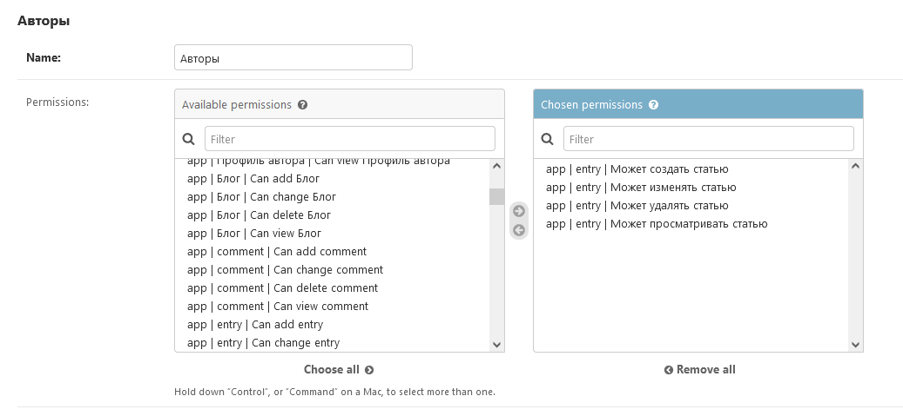

  > `owner` - это общепринятый термин, который используется в контексте моделей данных для указания на пользователя или владельца объекта. 
Это не встроенный атрибут Django или Python, поэтому его нужно создать в вашей модели данных, если вы хотите использовать 
его для указания на владельца объекта.

Если хочется почитать как работают разграничения именно в Django,а не DRF, то можно прочитать [здесь](https://colab.research.google.com/drive/1QvHVUhoG3dZqv2ePUxnrtVStsbUSTTsb)(не является обязательным, сделано как лекция)

## 1.1 Какие есть разрешения в rest_framework.permissions?

`rest_framework.permissions` предоставляет несколько встроенных классов разрешений для обеспечения безопасности в вашем API:
Некоторые из наиболее распространенных разрешений включают:

* `IsAuthenticated`: Пользователь должен быть аутентифицирован для доступа к ресурсу.


* `IsAdminUser`: Только пользователи с административными правами могут получить доступ к ресурсу.


* `AllowAny`: Доступ к ресурсу разрешен без аутентификации.


* `IsAuthenticatedOrReadOnly`: Аутентифицированные пользователи могут выполнять любые действия, а неаутентифицированные могут только читать (GET).


* `DjangoModelPermissions`: Разрешения, основанные на правах доступа к модели Django. Разрешает доступ на основе прав доступа add, change и delete модели Django.

  > По умолчанию данное разрешение даёт полный доступ на создание, чтение, изменение и удаление объектов модели. Чтобы ограничить это, то необходимо в самой модели в 
  > метаклассе прописать атрибут permissions и перечислением возможных действий над моделью. Как пример (только посмотреть):
  
  ```python
  class MyModel(models.Model):
      name = models.CharField(max_length=100)
  
      class Meta:
          permissions = [
              ("can_view_mymodel", "Можно посмотреть"),
              ("can_edit_mymodel", "Можно изменить"),
              ("can_delete_mymodel", "Можно удалить"),
          ]
  ```  
  > В данном примере над объектами таблицы MyModel можно совершать только действия над просмотром, изменением и удалением,
  > создать объект в БД не получится. Соответственно используя `permission_classes = [DjangoModelPermissions]`, то в API 
  > будут доступны все разрешения, что есть в модели.

* `DjangoModelPermissionsOrAnonReadOnly`: Аналогично `DjangoModelPermissions`, но неавторизированные пользователи могут просматривать ресурс.


* `DjangoObjectPermissions`: Разрешения, основанные на правах доступа к объекту Django. Позволяет настраивать доступ на основе атрибутов модели Django и прав доступа пользователя.

Все эти классы вы можете указывать в классовом атрибуте `permission_classes` вашего класса представления API.

## 1.2 Использование разрешений

По умолчанию к точке доступа API может подключиться любой желающий. Проверим это выйдя из под пользователя. И проверим доступность 
ресурса как представлению, что писали самостоятельно `AuthorAPIView` используя `APIView`

http://127.0.0.1:8000/api/authors/

`AuthorGenericAPIView` используя `GenericAPIView`

http://127.0.0.1:8000/api/authors_generic/

`AuthorViewSet` используя `ModelViewSet`

http://127.0.0.1:8000/api/authors_viewset/

Тоже самое можно проверить через Postman, любой из них будет работать, так как по умолчанию Postman проверяет доступность без 
авторизации.

Но вот допустим, нам не нравится, что доступ имеют все, допустим некоторая информация конфиденциальная или имеет ценность и хочется показывать 
её только авторизированным пользователям, таким образом добавим возможность проверять разрешения.

### 1.2.1 IsAuthenticated

Во `views.py` приложения `api` добавьте `permission_classes` в ваш `AuthorAPIView` 

```python
from rest_framework import permissions

class AuthorAPIView(APIView):
    permission_classes = [permissions.IsAuthenticated]
```

Теперь проверим доступность адреса

http://127.0.0.1:8000/api/authors/

И увидим, что необходимо авторизоваться


То же самое будет и в Postman


Если авторизироваться, то всё будет нормально, кроме Postman, про это поговорим в главе 2, про аутентификацию.

### 1.2.2 IsAdminUser, IsAuthenticatedOrReadOnly

`IsAdminUser`, `IsAuthenticatedOrReadOnly` работают идентично `IsAuthenticated` только `IsAdminUser` проверяет, что пользователь админ,
а `IsAuthenticatedOrReadOnly` даёт доступ на чтение неавторизированным пользователям, а авторизированным всё что требуется.


### 1.2.3 Пользовательские разрешения

Создадим свой класс разрешений, чтобы учесть все эти действия и добавим этот класс в `permission_classes` класса `AuthorGenericAPIView`


```python
class CustomPermission(permissions.BasePermission):
    """
    Пользователи могут выполнять различные действия в зависимости от их роли.
    """

    def has_permission(self, request, view):
        # Разрешаем только GET запросы для неаутентифицированных пользователей
        if request.method == 'GET' and not request.user.is_authenticated:
            return True

        # Разрешаем GET и POST запросы для аутентифицированных пользователей
        if request.method in ['GET', 'POST'] and request.user.is_authenticated:
            return True

        # Разрешаем все действия для администраторов
        if request.user.is_superuser:
            return True

        # Во всех остальных случаях возвращаем False
        return False


class AuthorGenericAPIView(GenericAPIView, RetrieveModelMixin, ListModelMixin, CreateModelMixin, UpdateModelMixin,
                           DestroyModelMixin):
    queryset = Author.objects.all()
    serializer_class = AuthorModelSerializer

    # Переопределяем атрибут permission_classes для указания нашего собственного разрешения
    permission_classes = [CustomPermission]
    
    # ...
```

Неавторизированный пользователь видит только GET запрос, POST и другие запросы не сделать

http://127.0.0.1:8000/api/authors_generic/

Авторизируемся под обычным пользователем 

username: `platon27`

password: `#8X+DujR!B`

Всех доступных пользователей можете найти в файле `users.json` в корне проекта, если его там нет, то найдете его в папке `tasks/lab5`

Теперь снова зайдем на 

http://127.0.0.1:8000/api/authors_generic/

Затем на 

http://127.0.0.1:8000/api/authors_generic/3/

И увидим, что ничего кроме GET и POST метода нет доступного


Авторизируемся под админом и увидим полный функционал над данными


# 2. Аутентификация

Для проверки путей через Postman достаточно просто подключиться к точке доступа не требующей авторизации

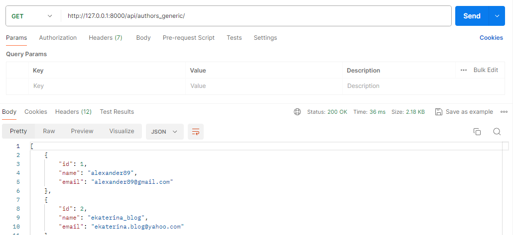

Но вот допустим для POST запроса наше представление проверяет авторизирован ли пользователь

В `Body` в `raw` задайте

```json
{
    "name": "user_abc",
    "email": "user@abc.abc"
}
```

И соответственно запрос не пропустит, так как не знает что за пользователь его задал


Но так как Django по умолчанию поддерживает Базовую Аутентификацию, то можно параметры пользователя передать в заголовке `HTTP_AUTHORIZATION`

## 2.1 Базовая аутентификация

Это простая форма аутентификации, где пользователь должен предоставить имя пользователя и пароль при каждом запросе.

Данные для Базовой Аутентификации передаются в кодировке `base64`.

Результат данной кодировки можно без проблем получить в python для этого достаточно воспользоваться модулем `base64`

Кодируется строка вида `login:password` получим кодированное представление для админа с его 

username: `admin`

password: `123`

В `Python Console` пропишите

```python
import base64

login = 'admin'
password = '123'
# Кодируем логин и пароль в виде строковой комбинации
credentials = base64.b64encode(f'{login}:{password}'.encode('utf-8')).decode('utf-8')
print(credentials)
```

Результат получим `YWRtaW46MTIz`


Теперь можем передать эти данные в `Headers` по ключу `Authorization` со значением `Basic YWRtaW46MTIz`, где 
`Basic` это название метода аутентификации.


Теперь если отправить данные на сервер, то создастся новый автор, а пользователь создавший его будет админ.

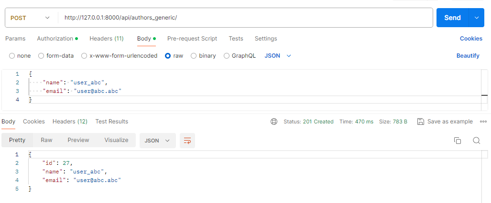


В Postman есть более удобный инструмент для кодирования в `base64`, чем ручное определение через `python`. 
Нажмите на кнопку `"Authorization"`, выберите тип `"Basic Auth"` и введите ваше имя пользователя и пароль.


Чтобы не было конфликтов, то удалите авторизационный заголовок из `Headers`

Изменим данные отправляемые на сервер в `Body` в `raw`, чтобы был создан новый автор, а не пришла ошибка, что автор уже существует

```json
{
    "name": "user1_abc",
    "email": "user1@abc.abc"
}
```

Отправляем и получаем ответ, что пользователь создан

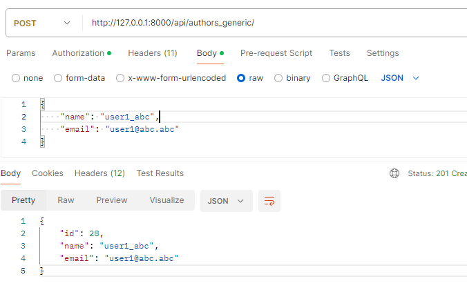


Base64 - это метод кодирования, который используется для представления бинарных данных в текстовом виде. Он не является методом шифрования или хеширования, а лишь представляет данные в другом виде.

Когда вы используете базовую аутентификацию, клиент отправляет на сервер строку в формате "Имя пользователя:Пароль", закодированную в Base64. Если у разных пользователей одни и те же аутентификационные данные, то при кодировании этих данных в Base64 они будут иметь одинаковое значение.

Однако стоит отметить, что Base64 не является безопасным методом хранения аутентификационных данных, так как он не является шифрованием. Даже если два пользователя имеют одинаковые авторизационные данные, это не является уязвимостью, так как безопасность базовой аутентификации зависит от других факторов, таких как использование HTTPS для защищенной передачи данных по сети.

В целом, использование Base64 для представления авторизационных данных в базовой аутентификации безопасно, при условии, что используется HTTPS для защиты передаваемых данных. Однако стоит избегать хранения чувствительной информации в таком формате и использовать более безопасные методы аутентификации, такие как OAuth или JWT.


Базовая аутентификация, хотя и является простым и легко понятным методом, имеет несколько уязвимостей:

* `Отправка в открытом виде`: При использовании базовой аутентификации данные (имя пользователя и пароль) отправляются в открытом виде через сеть. Это означает, что злоумышленники могут перехватить эти данные и использовать их для несанкционированного доступа.

* `Отсутствие шифрования`: Поскольку данные отправляются в открытом виде, базовая аутентификация не обеспечивает шифрования. Это делает ее уязвимой к атакам перехвата данных (например, через перехват пакетов сети).

* `Хранение паролей на стороне клиента`: Поскольку данные для аутентификации отправляются с каждым запросом, клиент должен хранить имя пользователя и пароль. Это может представлять риск безопасности, если злоумышленники получат доступ к хранилищу данных клиента.

* `Базовая аутентификация безопасна только при использовании HTTPS`: Для уменьшения рисков безопасности базовая аутентификация должна использоваться только вместе с HTTPS. В противном случае данные будут отправляться в открытом виде и станут уязвимыми к перехвату.

Из-за этих уязвимостей базовая аутентификация редко используется в приложениях, где требуется высокий уровень безопасности. Вместо этого обычно используются более безопасные методы аутентификации, такие как OAuth или JSON Web Tokens (JWT), которые обеспечивают более надежный уровень безопасности.


## 2.2 Сессионная аутентификация
Django также по умолчанию поддерживает сессионную аутентификацию.

Это более удобный способ аутентификации, где пользователь вводит имя пользователя и пароль один раз, и далее сохраняется сессия, подтверждающая аутентификацию.

Сессия это идентификатор, который хранится на сервере и передаётся в специальном файле cookie

Сессия и cookie - это два способа хранения информации о состоянии пользователя на веб-сайте, но они работают немного по-разному:

* `Cookie` (куки): Это небольшие фрагменты данных, которые веб-сервер отправляет в браузер пользователя, а браузер хранит их на локальной машине пользователя. 
Cookie обычно используются для хранения информации о предпочтениях пользователя, идентификаторов сессии, состояния входа в систему и т. д. 
Когда пользователь делает запрос на веб-сайт, весь cookie, относящийся к этому домену, автоматически включается в заголовки запроса и отправляется на сервер.


* `Сессия`: Это временный способ хранения информации о состоянии пользователя на сервере. Когда пользователь входит в 
систему или начинает сессию на веб-сайте, сервер создает уникальную сессию для этого пользователя и присваивает ей идентификатор сессии.
Этот идентификатор обычно сохраняется в cookie и отправляется обратно на сервер с каждым последующим запросом. 
На сервере информация о состоянии пользователя хранится в этой сессии. По завершении сессии (например, когда пользователь 
выходит из системы или закрывает браузер), информация о сессии удаляется. В Django сессия удаляется через 14 дней или после выхода из системы. Выход из браузера не влияет на продолжительность сессии.

Postman позволяет отправить `cookies`, чтобы была возможность сделать сессионную авторизацию

Для этого необходимо сначала узнать `id` сессии, это можно узнать в БД в таблице `django_session`, последняя строка будет соответствовать 
актуальной сессии. Необходимо значение из поля `session_key`

Это же значение можно получить из браузера, перейдите по http://127.0.0.1:8000/api/authors_generic/

И вызовите консоль разработчика, чаще всего это кнопка `F12`

Далее в зависимости от браузера путь до хранения cookie может отличаться

> Для Mozilla Firefox


> Для Google Chrome


> Для Яндекс Браузера


Нам будет необходимы две строки

`sessionid` и `csrftoken`

Далее переходим в Postman

В блоке `Authorization` ставим `No Auth`


В `Headers` прописываем `X-CSRFToken` со значением взятым из `csrftoken` в `cookie`


В Body в raw пропишем новые данные для POST запроса

```json
{
    "name": "user5_abc",
    "email": "user5@abc.abc"
}
```

И наконец перейдем в Cookies


Пропишем доменный адрес нашего локалхоста

`http://127.0.0.1:8000`

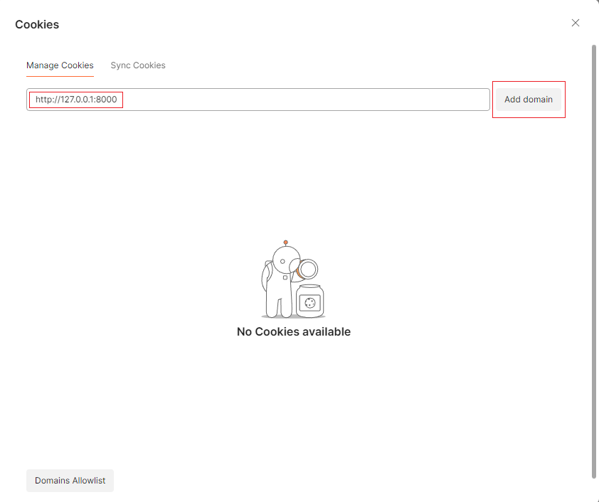

Затем уже добавляем куки


Необходимо только прописать название и значение, остальные параметры не трогайте, пусть будут по умолчанию

По ключу `sessionid` вставьте свои данные из браузера и сохраните этот cookie

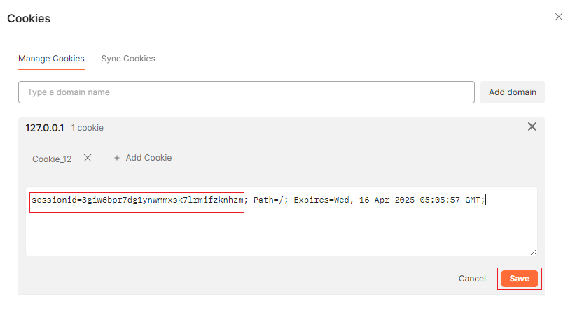

Добавьте ещё cookie нажав на `+ Add Cookie`

По ключу `csrftoken` вставьте свои данные из браузера и сохраните этот cookie


Закройте окно и выполните запрос, если всё верно, то новый автор создастся 

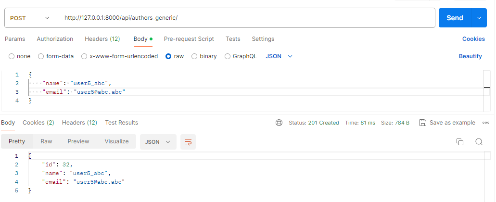

Сессионная аутентификация имеет свои преимущества и недостатки:

> Преимущества сессионной аутентификации:

* `Безопасность`: Поскольку идентификатор сессии хранится на сервере, а не на клиентской стороне, сессионная аутентификация обычно считается более безопасной, чем передача пароля в открытом виде (например, с помощью базовой аутентификации).
* `Простота использования`: Для пользователя сессионная аутентификация обычно более удобна, поскольку она не требует ввода пароля каждый раз при входе на сайт или выполнении защищенных действий.
* `Гибкость`: Сессионная аутентификация позволяет реализовать различные сценарии безопасности, такие как автоматический выход из системы после определенного периода неактивности или вход в систему с помощью многофакторной аутентификации. 

> Недостатки сессионной аутентификации:

* `Нагрузка на сервер`: Поскольку информация о сессии хранится на сервере, это может привести к увеличению нагрузки на сервер, особенно при работе с большим количеством активных сессий.
* `Зависимость от cookie`: Для сессионной аутентификации часто требуется использование cookie для хранения идентификатора сессии. Это означает, что если пользователь отключил cookie в своем браузере, сессионная аутентификация может не работать должным образом.
* `Уязвимость к атакам типа session hijacking`: Если злоумышленник получит доступ к идентификатору сессии, например, через перехват сетевого трафика или атаку CSRF, он может представиться этим пользователем и получить доступ к его учетной записи.

В целом, сессионная аутентификация является распространенным и удобным способом обеспечения безопасности веб-приложений, но она также имеет свои ограничения и риски, которые необходимо учитывать при разработке приложений.

## 2.3 Авторизация через токены

Авторизация по токенам (Token-based authentication) и сессионная авторизация (Session-based authentication) - это два различных подхода к аутентификации пользователей в веб-приложениях. 

Вот основные различия между ними:

> Хранение состояния (stateless vs stateful):

* `Токен`: Авторизация по токенам является "бессостоятельной" (stateless) системой, где сервер не хранит состояние аутентификации пользователя. Каждый запрос пользователя должен содержать токен, который сервер проверяет на валидность при каждом запросе.
* `Сессия`: Сессионная авторизация является "состоятельной" (stateful) системой, где сервер хранит информацию о сеансе пользователя (например, идентификатор сессии) на сервере. После успешной аутентификации пользователю присваивается сессионный идентификатор, который используется для идентификации пользователя при последующих запросах.

> Хранение токенов (token storage):

* `Токен`: Токены обычно хранятся на клиентской стороне, например, в Local Storage или в куки-файлах. Они могут быть долговременными (долговременные токены доступа) или краткосрочными (краткосрочные токены доступа или токены обновления).
* `Сессия`: Идентификаторы сессии хранятся на сервере и могут быть связаны с куки-файлом на клиентской стороне для идентификации пользователя при последующих запросах.

> Защита от CSRF-атак (Cross-Site Request Forgery):

* `Токен`: При использовании токенов CSRF-атаки становятся менее вероятными, так как токен должен быть явно передан с клиента на сервер и проверен на каждом запросе.
* `Сессия`: В сессионной авторизации защита от CSRF обычно достигается с использованием механизмов, таких как CSRF-токены, которые встраиваются в формы.

> Масштабируемость (scalability):

* `Токен`: Авторизация по токенам обеспечивает лучшую масштабируемость, поскольку она не требует хранения состояния на сервере. Это делает ее более подходящей для распределенных систем и микросервисных архитектур.
* `Сессия`: Сессионная авторизация может столкнуться с проблемами масштабируемости при большом количестве активных сеансов, поскольку требует хранения информации о сессиях на сервере.

### 2.3.1 TokenAuthentication

Помимо базовой аутентификации и аутентификации по сессии, среди доступных методов в DRF есть аутентификация 
по токенам. 


Для этого для `AuthorGenericAPIView` в `authentication_classes` пропишем `authentication.TokenAuthentication`

Для упрощения проверок сделаем, что получить информацию могут только авторизированные пользователи 

```python
from rest_framework import authentication

class AuthorGenericAPIView(GenericAPIView, RetrieveModelMixin, ListModelMixin, CreateModelMixin, UpdateModelMixin,
                           DestroyModelMixin):
    # ...
    permission_classes = [permissions.IsAuthenticated]
    authentication_classes = [authentication.TokenAuthentication]
    # ...
```

`TokenAuthentication` - это один из методов аутентификации в DRF, который позволяет аутентифицировать пользователей с 
использованием токенов. Токены предоставляются аутентифицированным пользователям и должны быть включены в заголовок запроса 
для аутентификации.

Для полноценной работы с токенами необходимо будет произвести ряд действий (так как будет создаваться таблица для 
хранения токенов в БД)

Добавьте `'rest_framework.authtoken'` в `INSTALLED_APPS` в файле `settings.py`:

```python
INSTALLED_APPS = [
    # ...
    'rest_framework',
    'rest_framework.authtoken',
    # ...
]
```

Запустите миграцию и создание таблиц в БД

```python
python manage.py migrate
```


Обычно происходит следующее: пользователь регистрируется, ему выдаётся токен доступа, который он использует для
доступа к API. При работе с сессиями происходит аналогично, выдаётся токен, записывается в сессию или куки, и уже
по этому токену происходит аутентификация.

Для начала токен нужно получить, это чем-то похоже на кодирование при `base64`, только используем токенизатор,
что DRF будет использовать при аутентификации.

Чтобы не писать целое представление по получению токена, его обновлению и другие моменты, то получим используем токен
вручную, для этого в `Python Console` пропишем

```python
from django.contrib.auth.models import User
from rest_framework.authtoken.models import Token

login = 'admin'

# Token от rest_framework работает с объектами модели
user = User.objects.get(username=login)
# Получение токена по объекту модели
token, created = Token.objects.get_or_create(user=user) 
print(token)  # 'c2674caef699d8f4bccfd7b8b04b297e1615cafa'
```

Теперь уже используем данный токен для доступа, так как даже простой GET требует токена доступа

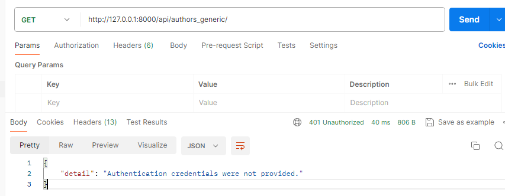

Далее в заголовках Headers пропишите ключ `Authorization` и значение `Token <number>`, где `<number>` значение токена полученного недавно.

Теперь к ресурсу возможно обратиться используя токен доступа.

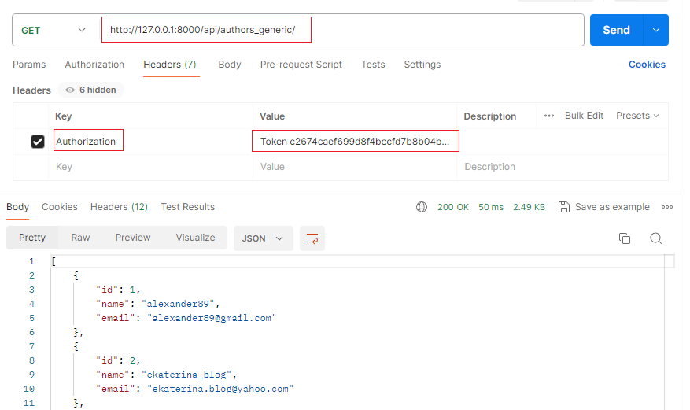

### 2.3.2 JSON Web Tokens(JWT)

`JSON Web Token(JWT)` - это компактный и самодостаточный способ представления информации между двумя сторонами в форме 
объекта в JSON-формате. JWT используется для передачи данных между клиентом и сервером в виде токена. Он может 
использоваться для аутентификации и обмена данными в безопасном формате.

#### 2.3.2.1 Теоретическая часть
JWT состоит из трех частей, разделенных точками:

1. Заголовок (Header): Заголовок содержит информацию о типе токена (JWT) и алгоритме подписи, используемом для создания 
и проверки подписи. Пример заголовка:

```python
{
  "alg": "HS256",
  "typ": "JWT"
}
```
2. Полезная нагрузка (Payload): Полезная нагрузка содержит данные (claims), которые хранятся в токене. В JWT есть три типа claims:

   * `Registered claims`: Эти claims являются стандартными и включают, например, iss (issuer), exp (expiration time), 
sub (subject), и другие.
   * `Public claims`: Эти claims определяются пользователем и/или приложением и могут использоваться для обмена 
дополнительной информацией.
   * `Private claims`: Эти claims также определяются пользователем, но они предназначены для обмена между сторонами, 
которые заранее договорились о их значении.

Пример полезной нагрузки:
```python
{
  "sub": "1234567890",
  "name": "John Doe",
  "exp": 1516239022
}
```
3. Подпись (Signature): Подпись создается путем кодирования заголовка, полезной нагрузки и секретного ключа алгоритмом, 
указанным в заголовке. Это делает JWT самодостаточным, так как сторона, получившая токен, может проверить его подлинность, 
раскодировав токен и проверив подпись.

Процесс работы JWT:

1. Пользователь входит в систему и аутентифицируется на сервере, который генерирует JWT.
2. Сервер включает в токен информацию о пользователе и другие данные, которые ему необходимы.
3. JWT отправляется обратно клиенту, который может хранить его (например, в куках или localStorage) и включать в заголовки 
запросов к серверу.
4. При каждом запросе на сервер клиент включает токен в заголовок запроса.
5. Сервер проверяет подпись токена, раскодирует полезную нагрузку и использует информацию для аутентификации пользователя 
и принятия решения о предоставлении доступа к запрошенным ресурсам.

JWT позволяет создавать безсостоятельные, расширяемые и безопасные токены, которые могут использоваться в различных контекстах, 
таких как аутентификация в API, одиночная сессия (Single Sign-On), обмен данными между сервисами и многое другое.

###### Практическая часть

Работу с токенами будем делать с помощью сторонней библиотеки `djangorestframework-simplejwt`
Ссылка на данный пакет есть в [официальной документации restframework](https://www.django-rest-framework.org/api-guide/authentication/#json-web-token-authentication) 

[Документация djangorestframework-simplejwt](https://django-rest-framework-simplejwt.readthedocs.io/en/latest/)

JWT тоже токены, но отличаются от подхода описанного в `TokenAuthentication`

Установим `djangorestframework-simplejwt`

```python
pip install djangorestframework-simplejwt
```

Регистрация в `INSTALLED_APPS` в `settings.py`

```python
INSTALLED_APPS = [
    # ...
    'rest_framework',
    'rest_framework_simplejwt',
    # ...
]
```

Для этого для `AuthorGenericAPIView` в `authentication_classes` пропишем `JWTAuthentication` из `rest_framework_simplejwt.authentication`


```python
from rest_framework_simplejwt.authentication import JWTAuthentication

class AuthorGenericAPIView(GenericAPIView, RetrieveModelMixin, ListModelMixin, CreateModelMixin, UpdateModelMixin,
                           DestroyModelMixin):
    # ...
    authentication_classes = [JWTAuthentication]
    # ...
```

Далее необходимо получить токен и с ним сформировать запрос на получение нужной информации.
Поможет получить токен обработчик `TokenObtainPairView` у `rest_framework_simplejwt.views`

Во `rest_framework_simplejwt.views` есть часть представлений, которые мы благополучно используем для своих нужд

В `urls.py` приложения `api` пропишем

```python
from rest_framework_simplejwt.views import TokenObtainPairView, TokenRefreshView, TokenVerifyView

urlpatterns = [
    # ...
    path('token/', TokenObtainPairView.as_view(), name='token_obtain_pair'),  # Получение токена
    path('token/refresh/', TokenRefreshView.as_view(), name='token_refresh'),  # Обновление токена
    path('token/verify/', TokenVerifyView.as_view(), name='token_verify'),  # Проверка токена
]
```

Теперь если попробуем получить токен, пройдя по http://127.0.0.1:8000/api/token/

То получим сообщение, что необходим POST запрос

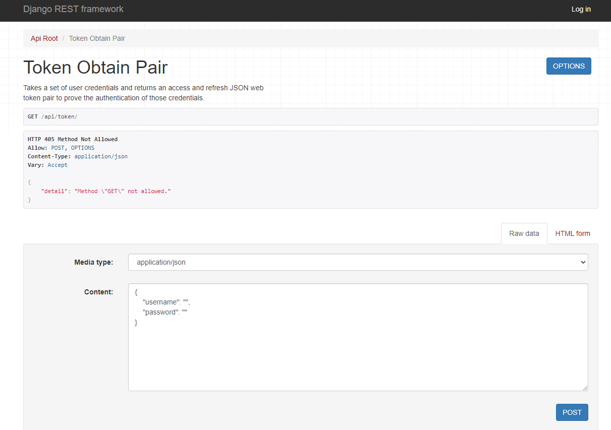

Сделайте POST запрос с данными 

```json
{
    "username": "admin",
    "password": "123"
}
```

Получим огромный токен доступа, так как в нем содержится вся необходимая информация (смотри теорию)


Нам нужен токен по ключу `access`

Настало время Postman, чтобы сделать запрос с данным токеном, по умолчанию вы можете создать обычный запрос, просто в 
заголовке `Authorization` нужно будет прописать `Bearer <token>`, где `<token>` тот токен по ключу `access`

В Postman в `Authorization` выберите `Bearer Token` и вставьте туда данные полученные из `access`

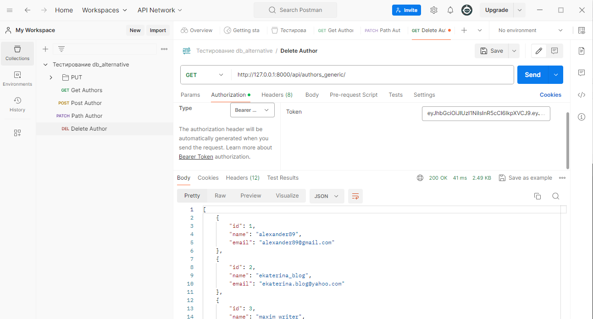

Если по каким-то причинам не получили доступа, то заново получите ключ отправив POST запрос на http://127.0.0.1:8000/api/token/

Таким образом `djangorestframework-simplejwt` и `rest_framework.authtoken` - это два разных способа аутентификации и авторизации в DRF
с использованием токенов. Они имеют несколько существенных различий:

1. Механизм аутентификации:

   * `rest_framework.authtoken` использует механизм аутентификации на основе токенов, где каждый пользователь имеет свой 
уникальный токен, который используется для аутентификации в API. Эти токены создаются и управляются на стороне сервера.

   * `djangorestframework-simplejwt` использует JWT для аутентификации. JWT - это стандартный формат токенов, который 
содержит информацию о пользователе и может быть подписан цифровой подписью. В отличие от `rest_framework.authtoken`, 
пользовательские данные хранятся внутри самого токена, и сервер не обязан хранить и управлять отдельными токенами.

 2. Хранение данных пользователя:

    * В случае `rest_framework.authtoken`, данные пользователя (например, его идентификатор) хранятся на стороне сервера, 
 и токены служат как ссылки на эти учетные записи пользователя.

    * В `djangorestframework-simplejwt`, информация о пользователе хранится внутри самого токена, и серверу не требуется 
 для проверки подлинности пользователя. Это делает JWT более масштабируемым в средах, где у вас может быть множество 
 серверов, так как он не требует обращения к серверу для проверки токена.

 3. Сложность и настройка:

    * `rest_framework.authtoken` более прост в настройке и использовании. Он предоставляет готовые представления и 
 аутентификационные классы для использования в DRF.

    * `djangorestframework-simplejwt` требует немного больше настройки, но предоставляет более гибкую и расширяемую систему 
 аутентификации с поддержкой JWT, включая возможность настройки срока действия и обновления токенов.

 4. Срок действия токена:
     Оба метода могут поддерживать срок действия токена, но в `djangorestframework-simplejwt` это реализовано более гибко 
и позволяет устанавливать срок действия как для доступа, так и для обновления токена.

 5. Производительность и безопасность:
     JWT более безопасен в том смысле, что информация в токене зашифрована и подписана, что обеспечивает целостность данных 
и защиту от подделки. Однако это также может сделать JWT более сложным для управления, если требуется много дополнительной информации о пользователе.

Выбор между `rest_framework.authtoken` и `djangorestframework-simplejwt` зависит от ваших требований и предпочтений. 
Если вам нужна быстрая и простая аутентификация с токенами, `rest_framework.authtoken` может быть хорошим выбором. 
Если вам нужна более гибкая и безопасная аутентификация с JWT, то `djangorestframework-simplejwt` может быть более подходящим вариантом.


# 3. Деплой

## 3.1 Скрываем всю чувствительную информацию

Устанавливаем модуль `python-dotenv` - пакет для работы удобной работы с переменными среды

`pip install python-dotenv`

Cоздайте файл `template.env` в корне проекта, где будем хранить переменные окружения. 
Этот файл не будет содержать самих значений, а только названия переменных.

```env
SECRET_KEY=
DEBUG=
ALLOWED_HOSTS=
```


Создайте файл `.env` м по тем же ключам добавьте значения

```python
SECRET_KEY=<ваши значения>
DEBUG=true
ALLOWED_HOSTS='localhost,127.0.0.1'
```


`SECRET_KEY` получаем из соответствующих переменных файла `settings.py`

В файле `settings.py` (папка project) выполняем загрузку переменных среды из файла `.env` с помощью 
установленного пакета, также в `settings.py` на нужных местах необходимо выгрузить 
значения из окружения:


```python
# settings.py
import os
from dotenv import load_dotenv

load_dotenv()  # здесь загружаются данные из .env и отправляются в переменные окружения

SECRET_KEY = os.getenv('SECRET_KEY')

DEBUG = os.getenv('DEBUG') == 'true'

ALLOWED_HOSTS = [host.strip() for host in os.getenv('ALLOWED_HOSTS').split(',')]
```


В `.gitignore` добавьте `.env`, чтобы на `github` не залилась чувствительная информация.


Затем в `settings.py` рядом со `STATIC_URL = 'static/'` пропишите

```python
STATIC_URL = "static/"  # Папка в корне проекта, где будут собираться статические файлы
if 'localhost' in ALLOWED_HOSTS:
   STATICFILES_DIRS = [os.path.join(BASE_DIR, 'static')]  # Папка для локального проекта
else:
   STATIC_ROOT = os.path.join(BASE_DIR, 'static')  # Папка для сервера
```


Используя параметр `STATICFILES_DIRS` вы можете указать, где Django будет искать статические файлы помимо папки `static` в каждом приложении

Конструкция if - else поможет в будущем и работать на сервере и на локальном проекте.
Так как параметр `STATICFILES_DIRS` нужен в режиме работы с локальным проектом (если вы решите собрать 
все статические файлы в одну корневую папку static, но даже если она указана, но её нет физически, 
то никакой ошибки не будет), 
а `STATIC_ROOT` с сервером (на сервере чаще всего присутствует условие, что вся статика должна быть в отдельной корневой папке static). 
Одновременно `STATICFILES_DIRS` и `STATIC_ROOT` не могут существовать в одном файле

`STATICFILES_DIRS` и `STATIC_ROOT` в Django выполняют разные функции.

* `STATICFILES_DIRS`: Это список папок, в которых Django 
ищет статические файлы при выполнении команды collectstatic или при 
использовании runserver в режиме отладки. Обычно используется для файлов,
которые изменяются в процессе разработки.

* `STATIC_ROOT`: Это путь к папке, в которую собираются (копируются) 
все статические файлы из приложений Django при выполнении команды 
collectstatic. Эта папка используется для предоставления статических 
файлов в production, когда ваш веб-сервер отдает файлы напрямую, а не 
через Django.

Перезапустите сервер и проверьте, что переменные окружения правильно подтянулись и всё работоспособно.

---

> Одно важное условие. На сервисе pythonanywhere не поддерживается postgreSQL на бесплатной основе, но поддерживается SQLite,
поэтому у тех, кто работает с использованием postgre, то переключитесь на SQLite обратно.

---

Обновите файл `requirements.txt`, чтобы внести в него новые модули и была возможность восстановить окружение

`pip freeze > requirements.txt`

Сделайте коммит ваших изменений
> Не включайте в коммит файл .env. 
Так как чтобы .gitignore заработал сначала нужно его закоммитить, иначе если закоммитить в одном коммите и .gitignore и .env,
то .env отправится на github, чего мы не хотим

И отправьте всё на сервер github. 

## 3.2 Деплой на сервис pythonanywhere


Зарегистрируйтесь на https://www.pythonanywhere.com/

Создайте Web приложение нажав `“Add a new app”`


Ваш бесплатный домен, по которому вы можете получать доступ к вашему приложению. 
Сохраните название этого домена, он понадобится чуть позже. Нажимаем Next


Выбираем “Manual configuration”.


Чтобы избежать непредвиденных ситуаций при развертывании выберите ту версию интерпретатора, которая была у вас на локальной машине.
На текущий момент сервис ограничен python 3.10, поэтому если использовали python 3.11 и 3.12, то в теории проблем не должно быть
если выберете 3.10.


Нажимаем Next и ждем пока создастся приложение


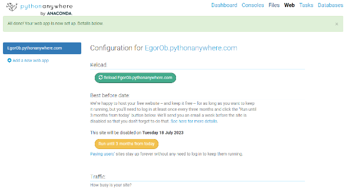

В `pythonanywhere` выбираем `Consoles` и `Bash`


Перед вами откроется консоль, через которую вы сможете настроить удаленный сервер и загрузить туда ваш Django проект

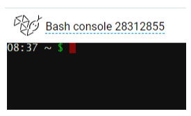

Далее необходимо склонировать `Ваш репозиторий` с github, что недавно пушили. 
Возьмём ссылку с вашего репозитория

> Картинка ниже как пример (копируем свою ссылку)


А затем с помощью команды загрузим проект на сервер:

```
git clone <url вашего репозитория>
```

Как пример `git clone https://github.com/EgorOb/pythonPy110_part2_dev.git`


С помощью команды `ls` убедимся что в директории существует папка с названием нашего проекта и перейдём в нее с помощью команды

```
cd <название вашего репозитория>
```


Далее нужно настроить виртуальное окружение, чтобы установить все зависимости, которые были установлены на вашей локальной машине. Создать виртуальное окружение можно с помощью команды

```python
python -m venv <название виртульного окружения>
```

Создание окружения может занимать значительное время (на примере окружения с названием venv)


Теперь следует активировать виртуальное окружение с помощью следующей команды

```
source <название виртуального окружения>/bin/activate
```


Установим все зависимости из файла `requirements.txt`

```
pip install -r requirements.txt
```

Далее создайте файл `.env` и заполните его необходимыми данными:

```
cp template.env .env
```

Любым удобным способом заполнить файл .env на удаленной машине (например, через графический интерфейс) Files -> <папка с вашим проектом> -> .env

>(Не обращаем внимания на название проекта, это пример)

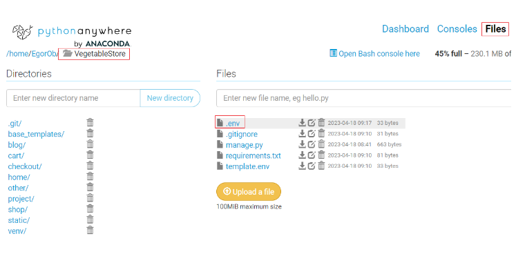

Скопируйте данные из вашего локального .env (все ключи) в .env на сервере 


> Обратите внимание, SECRET_KEY как на локальной машине, ALLOWED_HOSTS согласно вашему домену, 
полученному на шаге, когда просили сохранить адрес (если вдруг не сохранили этот адрес, то он есть на вкладке Web)

Зеленая кнопка, чтобы сохранить результат


Возвращаемся в консоль и прописываем команду для сбора всех статических файлов в одном месте (это условие сервера)

```python 
python manage.py collectstatic
```


Подготовка среды закончена теперь, нужно настроить приложение. Переходим во вкладку Web

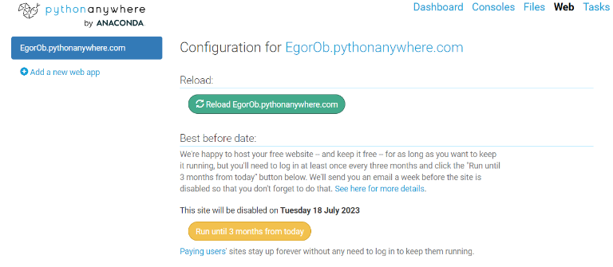

Находим блок “Code”, настраиваем папку с исходным кодом вашего проекта и рабочей директорией. Не обращаем внимание, что написано VegetableStore, это прошлый проект, в вашем случае будет папка с которой работаете на сервере 
(будет называться как ваш репозиторий)


Далее нужно настроить “WSGI configuration file”: нажимаем на синюю ссылку


В wsgi файле комментируем (работает комбинация Ctrl+/) 19-47 строки


Раскомментируем 76-89 строки отвечающие за wsgi для Django


Далее нужно настроить путь до файлов с настройками вашего приложения (файл settings.py) и файла, который управляет вашим приложением (manage.py). Переменная path должна быть равна пути до вашего проекта

Было


Стало


Переменная окружения на ваш модуль с настройками проекта должна быть изменена в соответствии с названием вашего проекта. Подсмотреть её значение можно в файле wsgi.py вашего Django проекта


Было


Стало


Также нужно подгрузить переменные среды, находящиеся в файле .env

```python
from dotenv import load_dotenv

load_dotenv(os.path.join(path, '.env'))
```


Сохраняем файл. Кнопка Save


Настраиваем путь до вашего виртуального окружения во вкладке Web

`<путь до проекта>/<названием виртуального окружения>`


Во вкладке Web настраиваем раздел “Static files”:

* URL = STATIC_URL из settings.py
* Directory = <путь до проекта>/<название папки со статическими файлами>


В данном сервисе проблематично указывать статические файлы для каждого приложения, придётся делать это вручную. 
Выход вынести все статические файлы в одну папку, что мы и сделали при вынесении папки со статическими файлами в корень проекта (collectstatic)

Перезапускаем приложение (зеленая кнопка, нужно будет подождать определенное время) и переходим по ссылке выше (доменное имя)


В результате, если всё сделано верно теперь на сервисе развернуто приложение с аналогичным функционалом как на локальной машине и можно будет его проверить через любой браузер по вашему доменному имени.

Теперь по адресной ссылке, на сайт можно зайти с любого устройства поддерживающее интернет соединение.


Обычно на практике никто не сохраняет БД на github, 
так как базы данных не должны также храниться в открытом месте, но в качестве упрощения себе жизни в .gitignore 
не стоит строчка с игнорированием базы данных Django (которая по умолчанию SQLite). 

___

> Если база не перенеслась или поставили игнорирование базы в .gitignore, то необходимо создать таблицы в БД
командой в консоле сервиса (обратите внимание, что в консоле должно быть активировано виртуальное окружение)

```python
python manage.py migrate
```

> Затем в вашем локальном проекте сделайте `dumpdata` вашей БД, перенесите этот файл на pythonanywhere и сделайте `loaddata` вашего файла

___

# Практика окончена

## 3.3. Частые вопросы после развертки первого приложения на pythonanywhere

* Как быстро перейти в консоль с виртуальным окружением?

> Можно зайти во вкладку Consoles и выбрать там вашу рабочую консоль. 
> На бесплатном аккаунте можно создать и поддерживать только 2 консоли. Закрыть консоль можно
> на крестик.


> Если вдруг нет той консоли в которой работали, то через вкладку 
> Web можно зайти в консоль под виртуальной средой

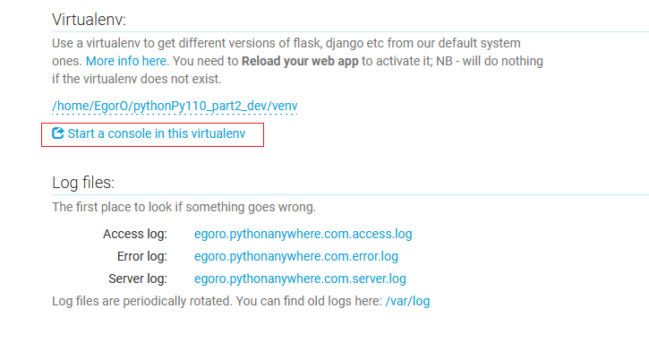

* Где посмотреть, если что-то упало и сайт не отображается?

> В логе ошибок на вкладке Web


* Я реализовал новый функционал в локальном проекте! Как это перенести на сервис?

> Перенос на сервис идёт по этапам получения изменений с github. Поэтому что необходимо:
> 1. Запуште ваши изменения на github (Если скачивали и использовали новые модули, 
> то перед отправлением на гитхаб сначала обновите requirements.txt.)
> 2. Подтяните ваши изменения с github на сервис используя команду `git pull`
>    * Есть определенная вероятность, что произойдет конфликт при слиянии(так как на гитхабе и на сервисе 
>    вы можете работать и изменять одни и теже файлы и нужно будет выбрать что с этим делать). Один из способов это 
>    откатить определенные изменения до последнего известного коммита на сервере, а затем снова сделать `git pull`.
>    Допустим часто такое бывает когда база данных не записана в .gitignore и на локальном проекте и на сервере отличается, так как они должны находиться там,
>    где используются, и соответственно могут иметь различия. Тогда можно попробовать откатить изменения до последнего известного коммита на сервере
>    при помощи команды  `git reset`, `git restore`, `git rm`, однако если данные что есть на сервере нужны, то придётся решать конфликт слияния (что для обычных файлов не так сложно, но бывает проблематично для баз данных).
> 3. Если после подтягивания ваших изменений вы использовали новые статические файлы или делали новые таблицы в базе данных, то можно использовать команды
> `python manage.py collectstatic` или `python manage.py migrate`
> 4. Перезапустите ваш сервер и теперь сервис будет с актуальными изменениями.

Пример ошибки при подтягивании изменений

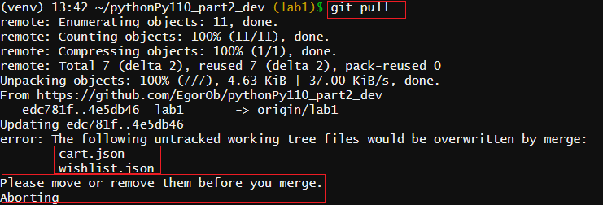

Сообщение об ошибке говорит о том, что у вас есть непроиндексированные (untracked) 
файлы в рабочем каталоге, которые перезапишутся при слиянии (merge). 
Прежде чем продолжить, вам нужно решить проблему с этими файлами. 

Вот несколько шагов, которые вы можете предпринять:

1. Если файлы на сервере просто не нужны, то можно их удалить, `rm cart.json wishlist.json`, а 
затем сделать `git pull`

2. Если пока не известно нужны они и нет, то можно их добавить в систему контроля версий `git add cart.json wishlist.json`
сделать временное сохранения изменений без фиксации (commit) `git stash`, затем сделать `git pull`, 
и уже решить что делать с теми файлами или их применять `git stash apply` и решать что оставлять что на сервере или на github 
или удалить эти файлы из временных  `git stash drop`.

3. Также можно добавить файлы в систему индексации `git add cart.json wishlist.json`, сделать коммит `git commit -m 'текст описания коммита'`,
а уже затем при `git pull` разбираться с коммитом слияния.

Для примера рассмотрю второй вариант.


* Полезные команды git для работы с терминалом pythonanywhere

> 1. `git restore <file>` - откатить файл до последнего известного коммита. 
Без изменения истории коммитов.
Применяется только к файлам которые есть в системе индексации. 
Откатывает до последнего известного состояния в системе индексации. 
Т.е. если файл до этого не был в системе индексации, то откатить его не получится, даже если добавить в систему индексации).

> 2. `git revert <commit>` - создает новый коммит, который отменяет изменения, внесенные предыдущим коммитом.
Удобно когда нужно откатиться к определенному коммиту в ветке, без потери всей истории, что была после этого коммита.

> 3. `git stash` - используется для временного сохранения изменений, 
чтобы вы могли переключиться на другую ветку без фиксации (commit) изменений. 
После git stash можно безопасно сделать git pull, затем нужно решить, что делать с данными временными файлами.
> * `git stash apply`: Эта команда применяет последний stash к вашему текущему рабочему дереву, но не удаляет stash.
> * `git stash pop`: Эта команда также применяет последний stash, но при этом удаляет его из списка stash.
> * `git stash drop`: Эта команда удаляет последний stash без его применения к текущему рабочему дереву.

> 4. `git reset` - используется для сброса текущей ветки к определенному коммиту. 
> По умолчанию сбрасывает до последнего коммита, но можно явно указать до какого.
> Есть 3 варианта сброса:

> * `git reset --soft <commit>` - Этот вариант устанавливает указатель HEAD и текущую ветку на определенный коммит, но оставляет изменения в индексе. 
> Это полезно, если вы хотите объединить несколько коммитов в один.

> * `git reset --mixed <commit>` (стоит по умолчанию `git reset <commit>`) - Этот вариант по умолчанию, 
> и он устанавливает указатель HEAD и текущую ветку на определенный коммит, 
> а также сбрасывает изменения в индексе. Рабочий каталог остается неизменным. Файлы выходят из системы контроля версий, но при это не удаляются.

> * `git reset --hard <commit>` - Этот вариант устанавливает указатель HEAD и текущую ветку на определенный коммит. 
> Все изменения в вашем рабочем каталоге и индексе будут потеряны. Будьте осторожны с этой командой, так как она изменяет историю и может привести к потере данных.

> 5. `git rm <file>` - удаляет файл из индекса и из рабочего каталога.


* Можно ли включить защищенное соединение?

> Да, сервис pythonanywhere позволяет работать с протоколом https. Forse HTTPS перевести в Enable. 
> Необходимо перезагрузить сервер

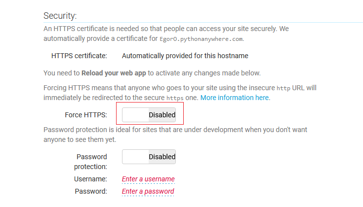


* Как перевести сервис из режима дебага?

> В параметрах DEBUG в `.env` на вашем сервисе с `true` поменяйте на `false` (необходимо сохранить, 
> а затем перезапустить сервер)

---

# <a name="section-optional-block"></a> <u>Необязательный блок</u> (выполнение по желанию)
